# 1. 三种交换方式
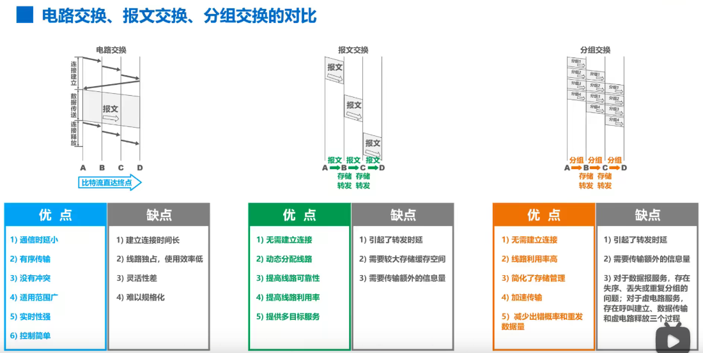

# 2. 计算机网络的分类
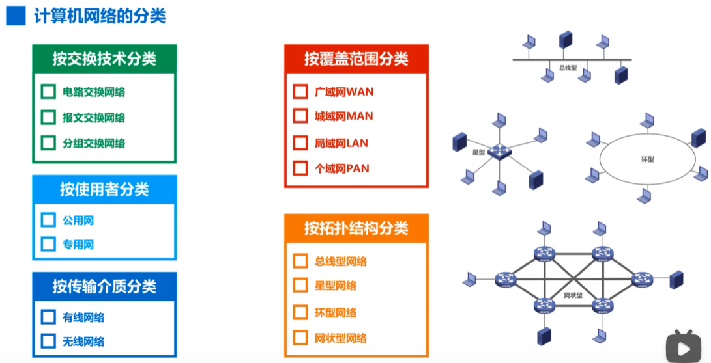

# 3. 计算机网络的性能指标
1. 速率
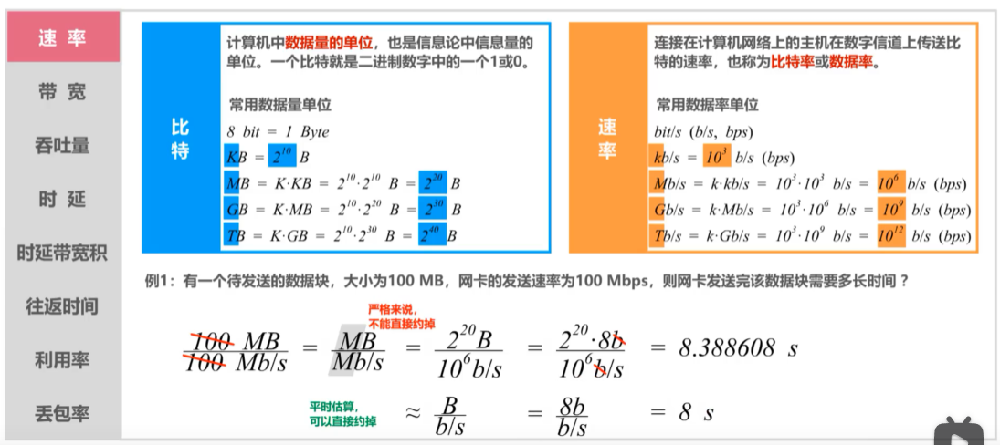

2. 带宽
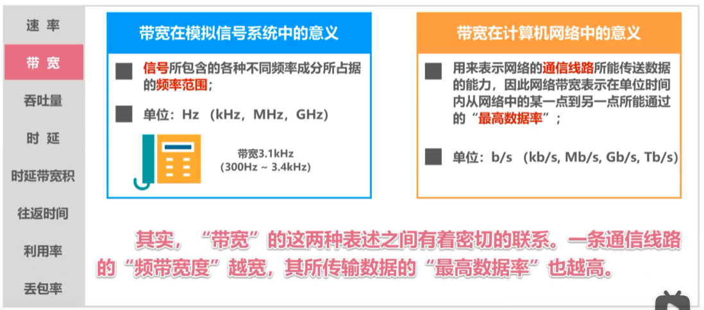

3. 吞吐量
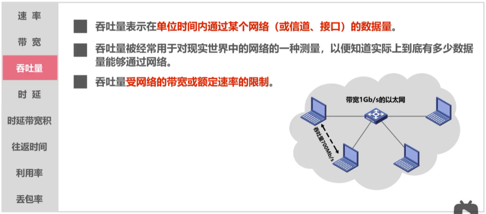

4. 时延
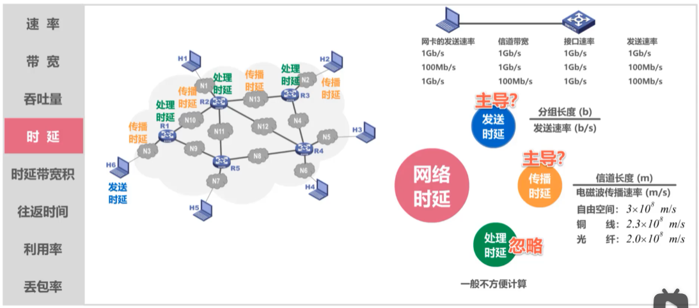
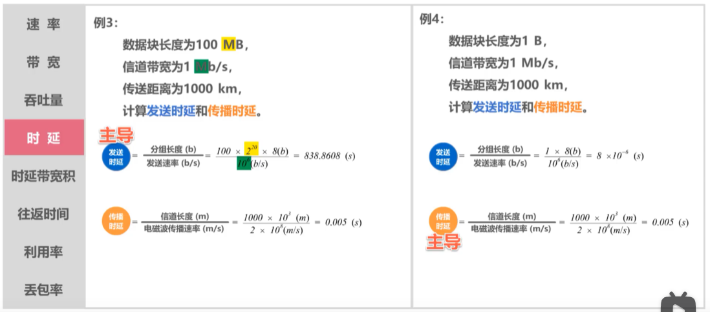

5. 时延带宽积
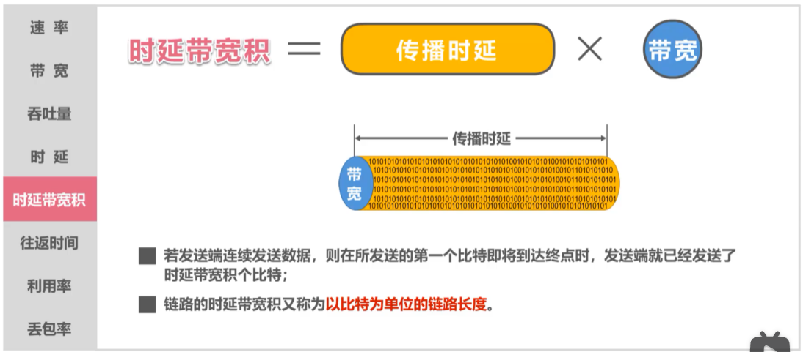

6. 往返时间
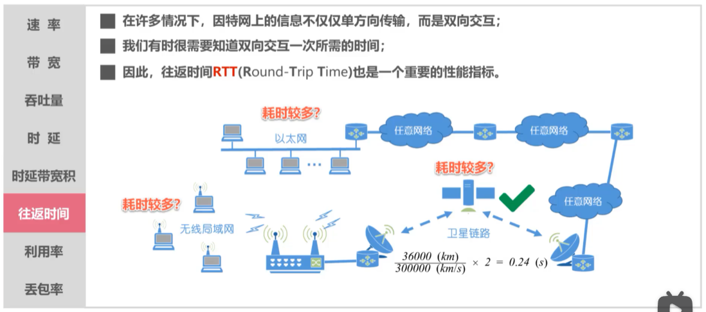

7. 利用率
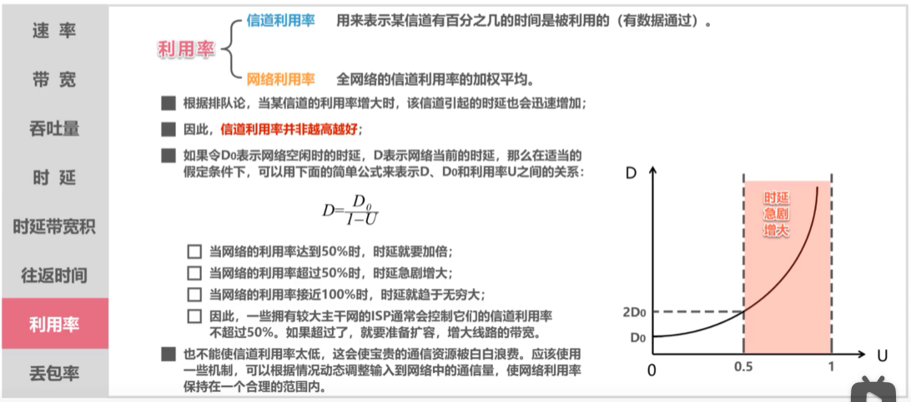

7. 丢包率
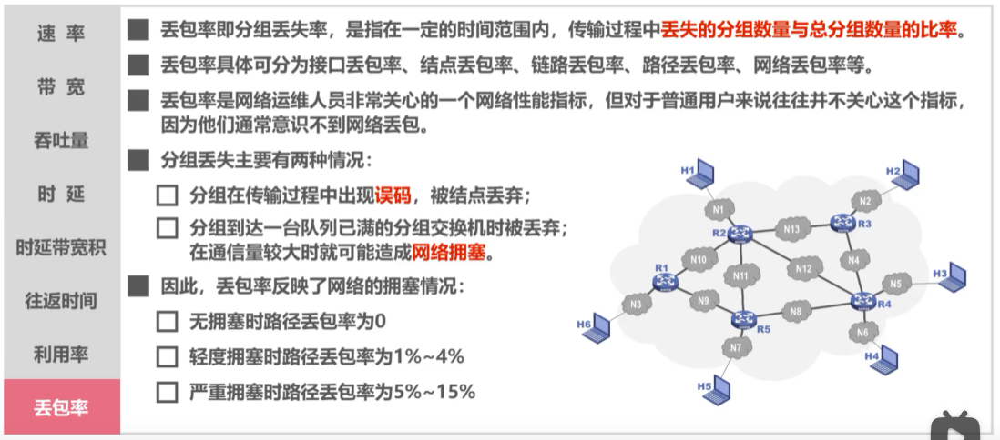

# 4. 计算机网络体系结构
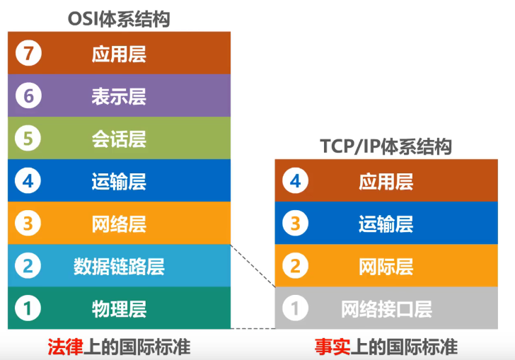
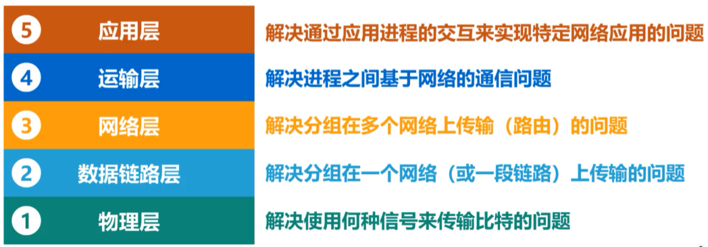

# 5. 术语解释
- 实体：任何可发送或接受信息的硬件或软件进程
- 对等实体：收发双方相同层次中的实体  

- 协议：控制两个对等实体进行逻辑通信的规则的集合
- 协议的三要素：
    - 语法：定义所交换信息的格式
    - 语义：定义收发双方所要完成的操作
    - 同步：定义收发双方的时序关系

- 服务：服务是指下层为紧邻的上层提供的功能调用，它是垂直的。
- 服务原语：上层使用下层所提供的服务时必须与下层交换一些命令， 这些命令在OSI中称为服务原语。
- PDU（协议数据单元）：对等层次之间传送的数据包
- SDU（服务数据单元）：同一系统内，层与层之间交换的数据包
